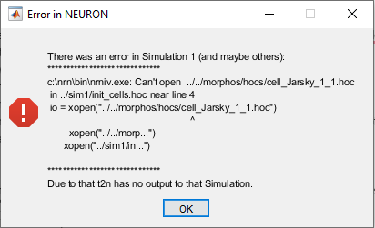

# Neuron Model Generation
This stage of the pipeline will generate NEURON HOC model files from .SWC morphology files, or TREES Toolbox generated .MTR files which contain multiple morphologies.

Currently, the pipeline supports the Jarsky model of the CA1 pyramidal cell. 

## Instructions

Before running any scripts utilizing TREES Toolbox, initialize TREES Toolbox by running the included start_trees.m. This only needs to be done once per computer.

Additionally, T2N must be initialized before use, with the script t2n_runthisAfterUnzip.m.

First, compile the mod files located in Generator/lib_mech/mods. This is a necessary step for each computer that the simulations are executed on. Refer to this [link](https://www.neuron.yale.edu/phpBB/viewtopic.php?t=3263) for more information on how to do this. After this is done, move the nrnmech.dll file to Generator/lib_mech.

The morphology files for this script must be in either .SWC or .MTR format. TREES Toolbox contains tools to process Neurolucida .ASC files into these formats.

Given a morphology specified in a file 'cell.ASC', the following commands in MATLAB with TREES Toolbox will save it as an .SWC file:

<code>tree = neurolucida_tree('cell.ASC');\
 SWC_tree(tree, 'cell.SWC');</code>

Place the input morphology file (either .SWC or .MTR if multiple morphologies are to be processed) into Generator/morphos alongside the place_tree.mtr file.

The input morphology must be in standard SWC format, with soma as region 1, axon as region 2, basal dendrites as region 3, and apical dendrite as region 4.

Open <code>Jarsky_model.m</code> in MATLAB and change the line labelled "Input file here" to refer to the selected input morphology. Run the script.

A prompt will open asking the user how they wish for the axon to be handled. "Do not alter" will make no changes. "No axon" will strip any existing axon from the morphology. "Stick axon" will add a simple straight axon in the negative Y direction. "Myelinated axon" will apply a basic myelination algorithm with nodes of Ranvier at 100um intervals and at every branch point.

For each morphology given, a figure will be produced showing the assigned model regions.

Every time the generation is completed, the script will return an error:

 Ignore this: It is expected. After completion, the script will copy all other necessary files to the model folders.

## Software Requirements

[MATLAB](https://www.mathworks.com/), [TREES Toolbox](http://treestoolbox.org/), [T2N](https://www.treestoolbox.org/T2N.html)
